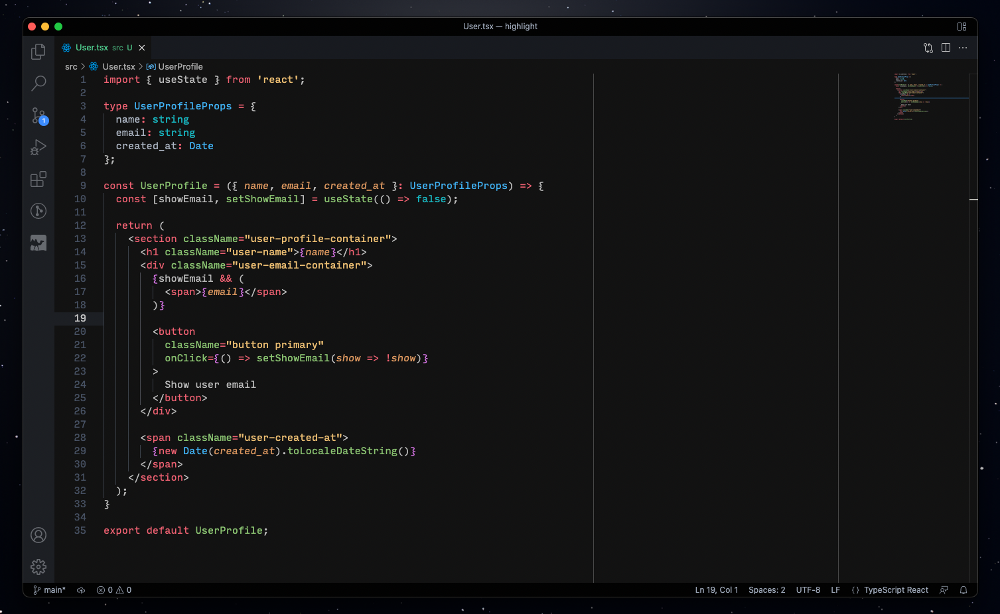

# [One Dark Pro Monokai Darker Reloaded](https://github.com/mxthevs/one-dark-pro-monokai-darker-reloaded)

[](https://marketplace.visualstudio.com/items?itemName=mxthevs.one-dark-pro-monokai-darker-reloaded) [](https://marketplace.visualstudio.com/items?itemName=mxthevs.one-dark-pro-monokai-darker-reloaded) [](https://marketplace.visualstudio.com/items?itemName=mxthevs.one-dark-pro-monokai-darker-reloaded)

## Just because you would think that the name couldn't get any longer

A darker variation of One Dark Pro theme for Visual Studio Code, with Monokai code coloring.

> This theme is a fork from [One Dark Pro Monokai Darker](https://marketplace.visualstudio.com/items?itemName=eserozvataf.one-dark-pro-monokai-darker), with subtle changes for better [semantic highlighting](https://code.visualstudio.com/api/language-extensions/semantic-highlight-guide). Check them out!

## Installation

Press `ctrl/command + shift + p` to launch the command palette, then run:
```
ext install mxthevs.one-dark-pro-monokai-darker-reloaded
```

## Screenshots




## Requirements

* Visual Studio Code (http://code.visualstudio.com/)

## License

MIT, for further details, please see [LICENSE](LICENSE) file.


## Contributing

See [contributors.md](contributors.md)

It is publicly open for any contribution. Bugfixes, new features and extra modules are welcome.

* To contribute to code: Fork the repo, push your changes to your fork, and submit a pull request.
* To report a bug: If something does not work, please report it using [GitHub Issues](https://github.com/mxthevs/one-dark-pro-monokai-darker-reloaded/issues).


## Support the original creator of this theme

[Visit his patreon profile at patreon.com/eserozvataf](https://www.patreon.com/eserozvataf)
